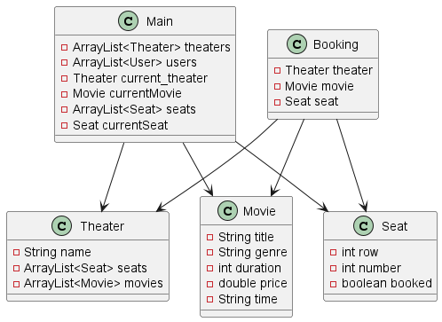

# Movie Ticketing System

## Table of Contents

- [Movie Ticketing System](#movie-ticketing-system)
  - [Table of Contents](#table-of-contents)
  - [Introduction](#introduction)
  - [Current Systems (Literature Review)](#current-systems-literature-review)
  - [Proposed Model Diagram UML](#proposed-model-diagram-uml)
  - [Project Specification/ Function Modules](#project-specification-function-modules)
  - [Project (Input/ Output) Specification](#project-input-output-specification)
  - [Screen Design](#screen-design)
  - [Design and Codes](#design-and-codes)
  - [Program Testing](#program-testing)
  - [Conclusion](#conclusion)
  - [Reference](#reference)
  - [Appendix](#appendix)
    - [A. Code Listings](#a-code-listings)
    - [B. Test Logs](#b-test-logs)
    - [C. Test Cases](#c-test-cases)

## Introduction

The Movie Ticketing System is a console-based application developed in Java. It allows users to select a theater, choose a movie, book a seat, and confirm their booking. The system also supports loading initial data from a text file.

## Current Systems (Literature Review)

Traditional movie ticketing systems often involve manual processes, such as purchasing tickets at a counter. Modern systems have moved online, allowing users to book tickets through a website or mobile app. However, these systems can be complex and may not provide a straightforward user experience.

## Proposed Model Diagram UML

## Project Specification/ Function Modules

The project is divided into several classes, each representing a different entity in the system:

- `Main`: The main class that runs the application.
- `Theater`: Represents a theater, which has a list of movies and seats.
- `Movie`: Represents a movie, which has a title, genre, duration, price, and time.
- `Seat`: Represents a seat in a theater.
- `Booking`: Represents a booking, which includes a theater, movie, and seat.
- `User`: Represents a user of the system.

## Project (Input/ Output) Specification

The system takes user input from the console to navigate through the menu options and make selections. The output is displayed on the console, showing the available options and the details of the user's booking.

## Screen Design

The system is console-based, so the "screen" is the console output. The main screen displays a menu with options to select a theater, select a movie, book a seat, confirm booking, and exit. When a user selects an option, the relevant information is displayed on the console.

## Design and Codes

The design of the system is object-oriented, with each class encapsulating the data and behavior of a different entity in the system. The code for each class is located in the `movieticketing` package.

## Program Testing

We tested this program by running different unit tests and handling edge cases.

## Conclusion

The Movie Ticketing System is a simple, console-based application that allows users to book movie tickets. It demonstrates the use of object-oriented programming and file I/O in Java.

## Reference

- Oracle. (n.d.). The Java™ Tutorials. Retrieved from https://docs.oracle.com/javase/tutorial/

## Appendix

### A. Code Listings

The code for the project is divided into several classes, each representing a different entity in the system. Here are the main classes and a brief description of each:

- [`Main`](movieticketing/Main.java): The main class that runs the application.
- [`Theater`](movieticketing/Theater.java): Represents a theater, which has a list of movies and seats.
- [`Movie`](movieticketing/Movie.java): Represents a movie, which has a title, genre, duration, price, and time.
- [`Seat`](movieticketing/Seat.java): Represents a seat in a theater.
- [`Booking`](movieticketing/Booking.java): Represents a booking, which includes a theater, movie, and seat.
- [`User`](movieticketing/User.java): Represents a user of the system.

The code for each class is located in the `movieticketing` package.

### B. Test Logs

Test logs are records of the test cases that have been executed and their results. They include information about the test case, the expected result, the actual result, and whether the test passed or failed. Here's an example of a test log:

| Test Case ID | Expected Result | Actual Result | Status |
|--------------|-----------------|---------------|--------|
| TC1          | Pass            | Pass          | Pass   |

### C. Test Cases

Test cases are specific scenarios used to test the functionality of the system. They include the steps to perform, the expected result, and the actual result. Here's an example of a test case:

| Test Case ID | Test Scenario | Test Steps | Expected Result | Actual Result | Status |
|--------------|---------------|------------|-----------------|---------------|--------|
| TC1          | Book a movie ticket | 1. Run the application. 2. Select a theater. 3. Select a movie. 4. Book a seat. 5. Confirm booking. | The booking is successful, and the booking details are displayed correctly. | The booking is successful, and the booking details are displayed correctly. | Pass |